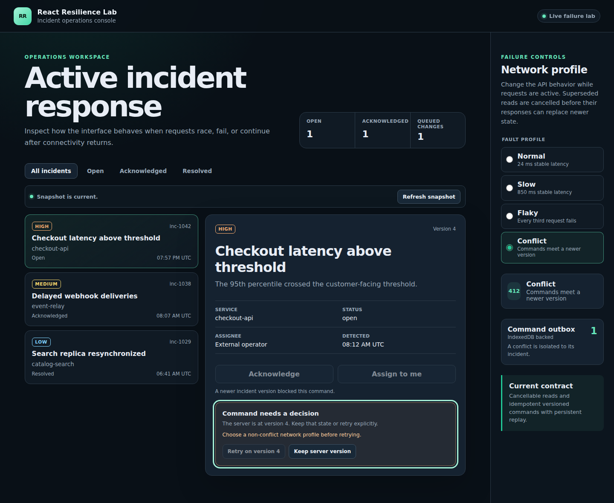
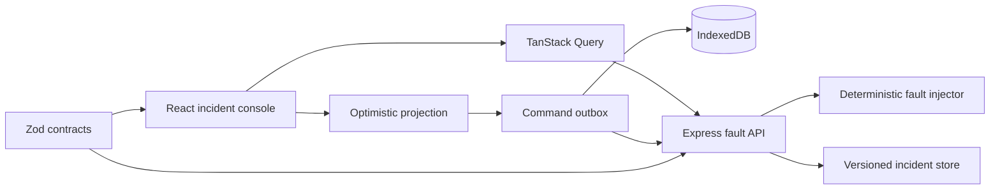

# React Resilience Lab

[](https://github.com/wasiliy-strecker/react-resilience-lab/actions/workflows/ci.yml)


[](LICENSE)

An executable reference for React interfaces that must remain correct when
requests race, connectivity disappears, retries repeat, or another operator
writes first.



The repository pairs a React 19 incident console with an intentionally
adversarial Node.js API. Failure behavior is deterministic, visible in the UI,
and covered at the boundary where it matters.

## What this proves

| Failure mode                                          | Design response                                                                     | Executable proof                                                                                    |
| ----------------------------------------------------- | ----------------------------------------------------------------------------------- | --------------------------------------------------------------------------------------------------- |
| A superseded read finishes late                       | Query identity includes every selector and the transport receives its `AbortSignal` | Controlled integration test observes cancellation and prevents stale replacement                    |
| The API disappears during a command                   | Write-ahead IndexedDB outbox projects the persisted intent                          | Chromium test reloads during the outage, restores the optimistic state, and replays after reconnect |
| A response is lost after the server applies a command | Stable command IDs are reused as idempotency keys                                   | API tests prove replay returns the first result without applying twice                              |
| Another operator updates the same incident            | `If-Match` version precondition blocks the command and returns authoritative state  | Chromium test requires an explicit keep-or-rebase decision and focuses the recovery panel           |
| A render or initial query fails                       | Error boundaries and retry actions preserve a keyboard recovery path                | React tests verify focus and reset behavior                                                         |
| Failure UI regresses semantically                     | Native controls, live regions, and deliberate focus management                      | axe runs against the integrated app in Chromium                                                     |

This lab demonstrates the hard part of optimistic UI: persistence,
reconciliation, ordering, and honest failure semantics. It does not present a
happy-path CRUD screen as resilience work.

## Implemented behavior

- shared Zod schemas with inferred TypeScript types at every HTTP boundary
- conditional writes through `ETag` and `If-Match`
- idempotent command replay through `Idempotency-Key`
- deterministic normal, slow, flaky, and conflict profiles
- typed problem details for validation, conflicts, and transient failures
- cancellable TanStack Query reads with selector-complete query keys
- explicit initial, background, stale-snapshot, empty, and error states
- generic command-outbox package with memory and IndexedDB adapters
- write-ahead optimistic projections that survive reloads
- per-incident FIFO, transient retry, and conflict isolation
- explicit discard or rebase recovery with focus management
- render-level recovery through a React error boundary
- Vitest coverage gates plus integrated Playwright and axe proofs
- CI across Node.js 22, 24, and 26

## Quick start

Requirements are Node.js 22.12 or newer and pnpm 11. Node.js 24 is the primary
development runtime.

```bash
corepack enable
pnpm install --frozen-lockfile
pnpm dev
```

Open `http://127.0.0.1:5173`. The supporting API listens on
`http://127.0.0.1:3001`.

Select a network profile in the right-hand panel, then change the selected
incident. The conflict profile performs a real concurrent write immediately
before the command reaches the version check.

## Architecture



The contracts package owns transport shapes, the outbox package owns generic
delivery state transitions, the web application owns presentation and client
orchestration, and the API owns authoritative command semantics.

Read the [architecture decisions](docs/architecture.md),
[failure model](docs/failure-model.md),
[race-safe query lifecycle](docs/query-lifecycle.md), and
[command outbox semantics](docs/outbox-semantics.md).

## Try the failure boundary

Select behavior per request with `X-Lab-Fault-Profile`:

```bash
curl -i \
  -H 'X-Lab-Fault-Profile: slow' \
  http://127.0.0.1:3001/api/incidents
```

The API reports the applied profile and delay in response headers. The `flaky`
profile rejects every third request with a typed `503`. The `conflict` profile
advances the target incident before applying a command, which produces a real
version mismatch rather than a hard-coded conflict response.

## Verification

```bash
pnpm verify
pnpm exec playwright install --with-deps chromium
pnpm test:e2e
```

`pnpm verify` formats, lints, type-checks, tests, and builds every workspace.
The browser suite starts both applications itself and covers outage reload,
conflict recovery, and automated accessibility checks. See the
[testing strategy](docs/testing-strategy.md) for the complete evidence map.

## Repository layout

```text
react-resilience-lab/
├── apps/
│   ├── fault-api/       Deterministic Node.js API and fault boundary
│   └── web/             React incident operations console
├── packages/
│   ├── command-outbox/  Generic queue core, adapters, and React bridge
│   └── contracts/       Shared Zod schemas and inferred types
├── e2e/                 Integrated Chromium resilience proofs
├── docs/                Architecture and failure guarantees
└── .github/workflows/   Multi-runtime CI and tagged releases
```

## Guarantees and limits

The browser-to-server path is at-least-once with idempotent handling, not
exactly-once. The demo API keeps state and replay records in memory. The
IndexedDB adapter assumes one active tab and does not implement leader
election. These limits are deliberate and documented instead of hidden behind
stronger claims than the code can support.

## License

Copyright 2026 Wasiliy Strecker. Licensed under the
[Apache License 2.0](LICENSE).
