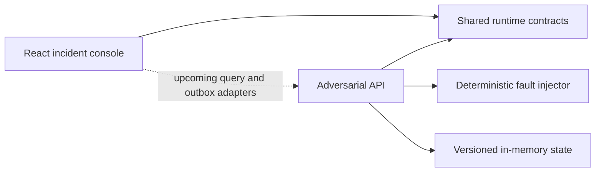

# React Resilience Lab

[](https://github.com/wasiliy-strecker/react-resilience-lab/actions/workflows/ci.yml)


[](LICENSE)

Production-minded React patterns for cancellation, race-free data fetching,
optimistic updates, conflict recovery, offline replay, and accessible failure
states.

The lab uses an incident operations console and an intentionally unreliable
Node.js API to make failure behavior reproducible. Every resilience claim is
designed to gain an executable proof as the project progresses.

## Why this project exists

Async interfaces often look correct on a stable local connection while hiding
failure modes that appear in production:

- an older response replaces data from a newer filter
- an optimistic change remains visible after the server rejects it
- reconnecting submits the same mutation more than once
- a version conflict silently overwrites another operator's work
- loading and error states remove context or strand keyboard focus

The repository isolates these behaviors in one small domain instead of hiding
them inside an unrelated product.

## Implemented behavior

The current API milestone establishes:

- runtime-validated incident and command contracts with Zod
- conditional writes through `If-Match` and explicit incident versions
- idempotent command replay through `Idempotency-Key`
- deterministic normal, slow, flaky, and conflict profiles
- typed problem details for validation, conflicts, and transient failures
- a responsive React incident console with a stable baseline profile
- strict TypeScript, type-aware ESLint, coverage thresholds, and CI

Remote queries, durable mutation replay, and client recovery semantics arrive in
focused pull requests so their design remains reviewable.

## Quick start

Requirements are Node.js 22.12 or newer and pnpm 11. Node.js 24 LTS is the
primary runtime.

```bash
corepack enable
pnpm install --frozen-lockfile
pnpm dev
```

Open `http://127.0.0.1:5173`. The supporting API listens on
`http://127.0.0.1:3001`.

## Architecture



The contracts package owns transport shapes, not application behavior. The web
application owns presentation and client orchestration. The API owns the
authoritative incident state, command semantics, and fault injection.

## Try the failure boundary

Select behavior per request with `X-Lab-Fault-Profile`:

```bash
curl -i \
  -H 'X-Lab-Fault-Profile: slow' \
  http://127.0.0.1:3001/api/incidents
```

The response reports the applied profile and delay in
`X-Lab-Fault-Profile` and `X-Lab-Delay-Ms`. The `flaky` profile rejects every
third request with a typed `503` response. The `conflict` profile advances an
incident immediately before a valid command is applied, producing a real
version conflict rather than returning a hard-coded error.

See [Failure model](docs/failure-model.md) for the profile matrix, command
protocol, guarantees, and deliberate non-goals.

## Verification

```bash
pnpm format:check
pnpm lint
pnpm typecheck
pnpm test
pnpm build
```

`pnpm verify` runs the complete sequence. CI verifies Node.js 22, 24, and 26.

## Repository layout

```text
react-resilience-lab/
├── apps/
│   ├── fault-api/       Deterministic Node.js API and fault boundary
│   └── web/             React incident operations console
├── packages/
│   └── contracts/       Shared Zod schemas and inferred TypeScript types
└── .github/workflows/   Reproducible CI verification
```

## License

Copyright 2026 Wasiliy Strecker. Licensed under the
[Apache License 2.0](LICENSE).
