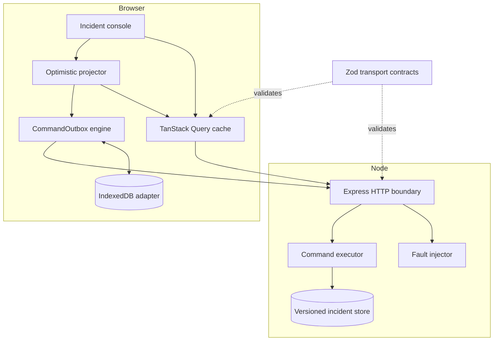
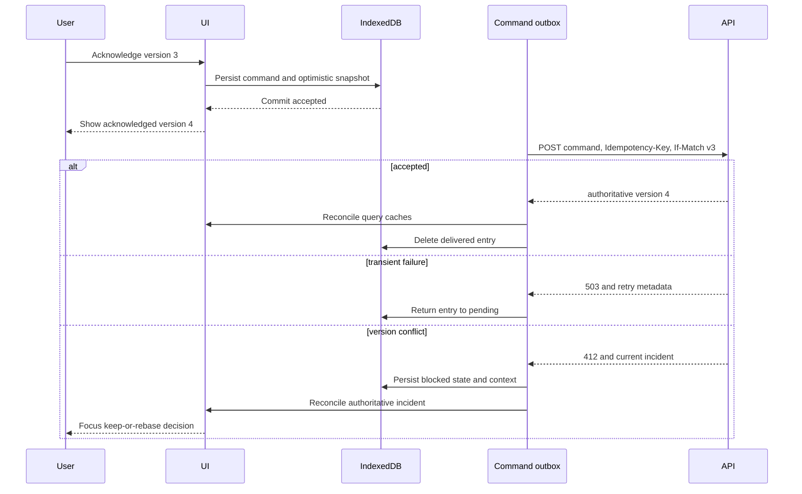

# Architecture decisions

React Resilience Lab separates transport contracts, authoritative state,
delivery mechanics, and presentation so each failure has one clear owner. The
application is intentionally small enough to review, while the boundaries are
the same ones needed in a larger product.

## Runtime topology

## Dependency ownership

| Area                      | Owns                                                                                  | Does not own                       |
| ------------------------- | ------------------------------------------------------------------------------------- | ---------------------------------- |
| `packages/contracts`      | HTTP payload schemas and inferred static types                                        | React state or command execution   |
| `packages/command-outbox` | persistence, entry state transitions, partition ordering, transport and storage ports | incident-specific payloads or HTTP |
| `apps/web`                | query identity, optimistic projection, reconciliation, recovery UI, focus             | authoritative business state       |
| `apps/fault-api`          | versions, preconditions, idempotency, deterministic faults                            | client retry or rendering policy   |

Dependencies point inward to contracts and ports. The generic outbox never
imports incident types. Its React entry point is separate, so the core can be
used without React.

## Read path

1. Status and fault profile form the complete TanStack Query key.
2. TanStack Query gives the query function an `AbortSignal`.
3. The API client forwards that signal to `fetch` without wrapping it.
4. Unknown response JSON is parsed by a Zod schema before entering the cache.
5. A refetch failure retains the last valid snapshot and becomes a visible UI
   state.

Cache identity prevents results for different selectors from sharing a slot.
Cancellation reduces wasted work and ensures this client stops observing the
superseded operation. It does not claim that every upstream intermediary stops
processing immediately.

## Command path

The optimistic state comes from the persisted envelope, not a closure held in
component memory. That makes reload recovery possible and lets a conflict
remove the optimistic projection as soon as authoritative state arrives.

## Key decisions

### Persist before delivery

The UI reports a command as accepted only after IndexedDB stores it. Network
delivery starts afterwards. A storage failure therefore blocks the command
instead of producing an optimistic state that cannot be recovered.

### Partition by aggregate

Incident ID is the queue partition key. The earliest command for one incident
must finish or be resolved before later commands for that incident can run. A
blocked incident does not stop other partitions.

### Reconcile instead of invalidating blindly

Successful and conflicting command responses contain an authoritative
incident. The adapter updates every compatible cached list immediately. This
avoids a temporary rollback to an older snapshot while a refetch is in flight.

### Make conflict recovery a new intent

A blocked command is never silently rewritten. Choosing retry creates a new
command ID against the displayed server version, removes the old command, and
then delivers the replacement. Choosing keep removes the blocked intent.

### Keep test controls out of the default API

The browser suite needs deterministic state. The reset route exists only when
`LAB_TEST_RESET_TOKEN` is configured and requires the matching header. A
normal API process does not register that route.

## Deliberate limits

- API state and idempotency records are in memory and do not coordinate across
  processes.
- IndexedDB has no multi-tab leader election or storage-quota recovery.
- The queue currently drains partition heads sequentially.
- Browser delivery is at-least-once. Exactly-once is not claimed.
- axe catches a useful class of accessibility defects, not every usability or
  assistive-technology issue.
