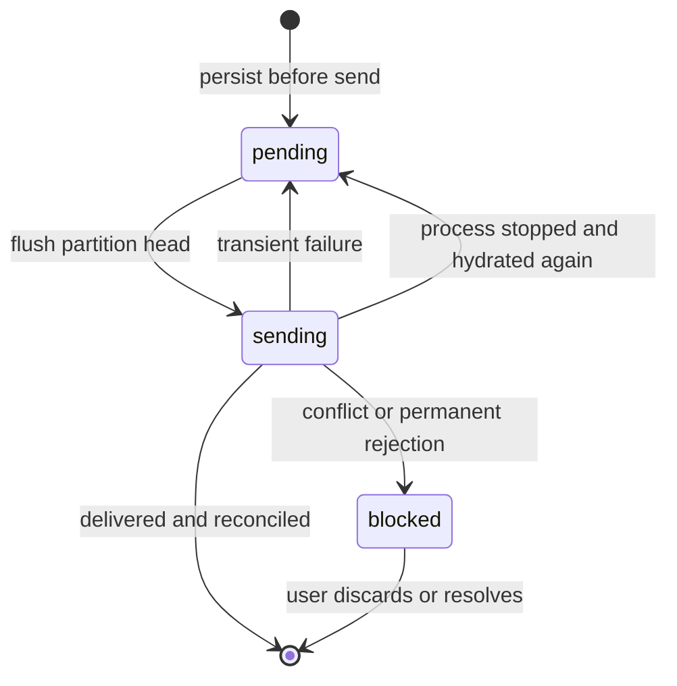

# Persistent command outbox semantics

The browser outbox makes command persistence happen before network delivery. It
is a small generic package with storage and transport ports, an in-memory
adapter, an IndexedDB adapter, and a React bridge based on
`useSyncExternalStore`.

## State model

An entry contains a stable command ID, partition key, semantic fingerprint,
payload, enqueue sequence, attempt count, and serializable failure context. The
incident adapter uses the incident ID as the partition key and the API command
ID as both outbox identity and `Idempotency-Key`.

## Ordering and isolation

Only the earliest remaining entry in a partition may be delivered. A blocked
command therefore pauses later commands for the same incident. The drain loop
continues scanning other partition heads, so a conflict on one incident does
not stop unrelated work.

The current engine delivers partition heads sequentially. It guarantees FIFO
within a partition but does not claim parallel throughput across partitions.
That choice keeps state transitions and tests deterministic while leaving the
transport and storage ports independent of scheduling policy.

## Optimistic projection

Pending commands do not mutate the authoritative TanStack Query cache. Each
persisted envelope contains the projected incident snapshot, and the view
derives a display snapshot from authoritative data plus active outbox entries.

This has three useful consequences:

- reloading the page can restore the optimistic state from IndexedDB
- a blocked entry stops contributing its optimistic projection immediately
- the authoritative incident from a `412` response can replace the cached
  entity without reconstructing an in-memory rollback closure

On successful delivery, the returned incident is reconciled across all cached
status and fault-profile queries before the entry disappears.

## Retry and connectivity

Network exceptions and typed `5xx` problem responses return an entry to
`pending`. If the problem includes `retryAfterMs`, the provider schedules the
next flush for that delay. When the browser is offline, flush is a no-op and the
entry remains in IndexedDB. The browser `online` event triggers another flush.

`409` rejections and `412` version conflicts become `blocked` instead of being
retried forever. Conflict problem details are persisted with the entry so the
client can show and later resolve against the authoritative version.

## Crash boundaries

| Interruption point                | Observable result after restart               |
| --------------------------------- | --------------------------------------------- |
| Before IndexedDB `put` completes  | The UI has not accepted the command           |
| After persistence, before send    | Hydration restores a pending command          |
| While marked `sending`            | Hydration changes it back to pending          |
| Server applied, response was lost | The same command ID is sent again             |
| Server returns a version conflict | The entry remains blocked with context        |
| Delete after success fails        | A later send reuses the same command identity |

This is at-least-once transport with idempotent handling, not exactly-once
delivery. The API currently stores replay results in memory. If both browser
delivery and the API process fail at the worst point, the version precondition
still prevents the same transition from blindly applying to a newer incident,
but durable server-side idempotency is outside this lab milestone.

## Current limits

- The IndexedDB adapter assumes one active outbox owner. Multi-tab leader
  election and cross-tab locking are not implemented.
- Commands and failure context must be structured-clone compatible.
- Blocked commands require an explicit user recovery decision. They are never
  silently rewritten to a new expected version.
- IndexedDB durability depends on browser storage policy and available quota.
