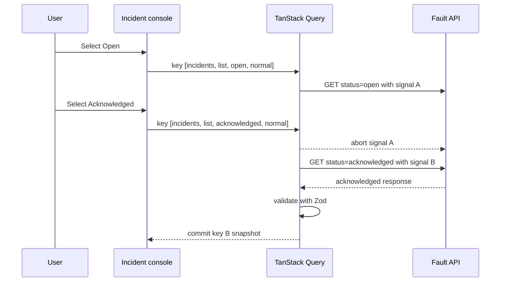

# Race-safe query lifecycle

The incident console treats request cancellation, cache identity, response
validation, and visible UI state as one boundary. Avoiding stale screens is not
left to component timing.

## Request path

Status and fault profile are both part of the query key. A response can only
populate the cache entry that requested it. When the view stops observing an
in-flight key, TanStack Query aborts the provided signal, and the API client
passes that exact signal to `fetch`.

The test suite starts a controlled `open` request, switches to
`acknowledged`, observes the first request signal being aborted, and verifies
that only acknowledged data remains visible. No random delay or real timer is
used to decide the winner.

## Runtime validation before caching

Transport data enters the application through `fetchIncidentList`. Successful
responses must satisfy `incidentListResponseSchema` before the query resolves.
Failed responses must satisfy `apiProblemSchema` before they become a typed
`IncidentApiError`.

This keeps unknown JSON out of the cache and preserves structured recovery
fields such as `code` and `retryAfterMs`. A malformed success or error response
is rejected explicitly instead of being cast to a TypeScript type.

## Visible state policy

| Query condition             | Interface behavior                                           |
| --------------------------- | ------------------------------------------------------------ |
| First request pending       | Show a dedicated initial loading state                       |
| Filter or profile changes   | Keep the previous snapshot visible and mark it as switching  |
| Same key refetches          | Keep context visible and report a background refresh         |
| Background refetch fails    | Preserve the last successful snapshot and expose the failure |
| First request fails         | Show typed error detail and an explicit retry action         |
| Valid response has no items | Show a stable empty list and detail state                    |

Automatic retries are disabled for this lab stage. A hidden retry would make
the deterministic flaky response difficult to inspect and could multiply load
during an outage. Retry policy will be introduced only where the UI can explain
the attempt and the server supplies usable retry semantics.

## Why the list does not use Suspense

The console deliberately renders the query lifecycle directly. Keeping the
previous snapshot, differentiating initial load from background refresh, and
displaying a recoverable stale snapshot are domain states here, not generic
fallbacks. This also keeps cancellation ownership at the query function where
the transport signal is visible and testable.

## Current guarantees and limits

- Superseded incident reads consume and forward an `AbortSignal`.
- Filter and profile combinations cannot overwrite each other in the cache.
- Only runtime-validated data becomes a successful query result.
- A failed refetch does not discard the last successful snapshot.
- The browser cannot force an upstream server to stop work after a disconnect.
  Cancellation guarantees that this client ignores the superseded result, not
  that every intermediary has stopped processing it.
